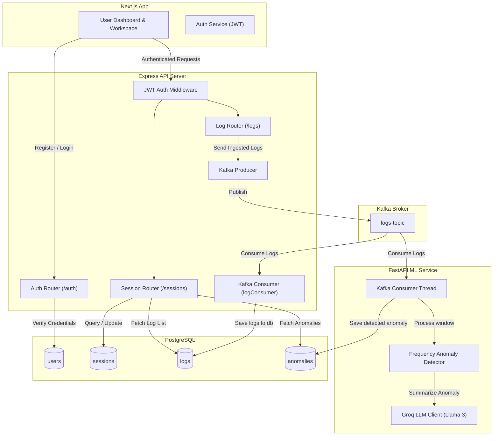

# 🏗️ LogGPT System Architecture

LogGPT is a production-grade, multi-user SaaS log analysis and anomaly detection platform. It uses a modern event-driven microservices architecture to process large streams of logs in real-time, detect anomalies, generate AI-driven summaries, and isolate user data securely.

---

## 🗺️ System Overview

The platform consists of five primary components:
1. **Frontend**: Next.js & React SPA for UI interactions, session views, log streaming, and anomaly dashboard.
2. **Backend**: Node.js & Express REST API server. Handles user authentication, session state management, and serves as a Kafka producer. It also hosts a built-in Kafka consumer.
3. **Message Queue (Kafka)**: A distributed message streaming system running a single topic (`logs-topic`) to decouple ingestion from processing.
4. **ML Service**: Python FastAPI service that consumes the log stream, runs a sliding-window algorithm to detect error rate anomalies, calls Groq API for LLM-based troubleshooting insights, and writes anomaly logs to the database.
5. **Database**: PostgreSQL for persistent storage of users, sessions, parsed logs, and anomalies.



---

## 🔄 Core Data Flows

### 1. Ingestion Flow (Sync to Async)
1. **User Action**: The user drops a log file into the UI and clicks **Upload Logs**.
2. **REST API**: Next.js sends a `POST /api/logs/upload` request with the logs payload and JWT.
3. **Authentication**: The backend's `authMiddleware` validates the token and attaches the `user_id` to the request object.
4. **Session Setup**: The backend creates a new analysis session in the `sessions` table.
5. **Kafka Publishing**: The backend maps the log array (attaching `user_id` and `session_id` to each log object) and publishes them asynchronously to the Kafka topic `logs-topic` via `sendLogsToKafka`.
6. **Response**: The API immediately returns `200 OK` to the frontend with the `sessionId`, keeping the HTTP connection short.

### 2. Log Consumption Flow
1. **Consumer Trigger**: The backend's built-in background Kafka Consumer (`logConsumer.js`) detects new messages on `logs-topic`.
2. **DB Persistence**: The consumer parses each log object and saves it to the `logs` table in PostgreSQL.
3. **Real-time Availability**: Since the logs are saved with the corresponding `session_id` and `user_id`, they become queryable via `GET /sessions/:id/logs`.

### 3. Real-time Anomaly Detection Flow
1. **ML Consumer**: The FastAPI ML Service runs a background consumer thread listening to `logs-topic`.
2. **Sliding Window**: For each log, the service routes it to a `FrequencyAnomalyDetector` scoped to its `sessionId`.
3. **Spike Evaluation**: The detector tracks `ERROR` log timestamps in a rolling 60-second window. If the count exceeds the configured `error_threshold`, it flags an anomaly.
4. **AI Summarization**: The service aggregates recent logs, extracts unique patterns (normalizing numbers and IDs), and calls the Groq API using Llama 3 to formulate a natural language description of what caused the spike.
5. **Persistence**: The ML Service connects to PostgreSQL and writes the details to the `anomalies` table, associating it with the proper `session_id` and `user_id`.

---

## 🔒 Multi-User SaaS Data Isolation

LogGPT is built with strict multi-user data isolation. Every table is bound to the `users` table via foreign keys, and indexes are optimized for filtering queries.

* **User Ownership**: All logs, sessions, and anomalies belong to a specific `user_id`.
* **Isolated Queries**: Every database select, update, or delete executed by the controller checks the `user_id` parsed from the JWT header:
  ```sql
  SELECT * FROM sessions WHERE user_id = $1;
  SELECT * FROM logs WHERE user_id = $1 AND session_id = $2;
  SELECT * FROM anomalies WHERE user_id = $1 AND session_id = $2;
  ```
* **Security at the Middleware Level**: If a user tries to access a session ID that belongs to another user, the query filters out the results and returns a `404` or `401`, preventing cross-tenant data leaks.
