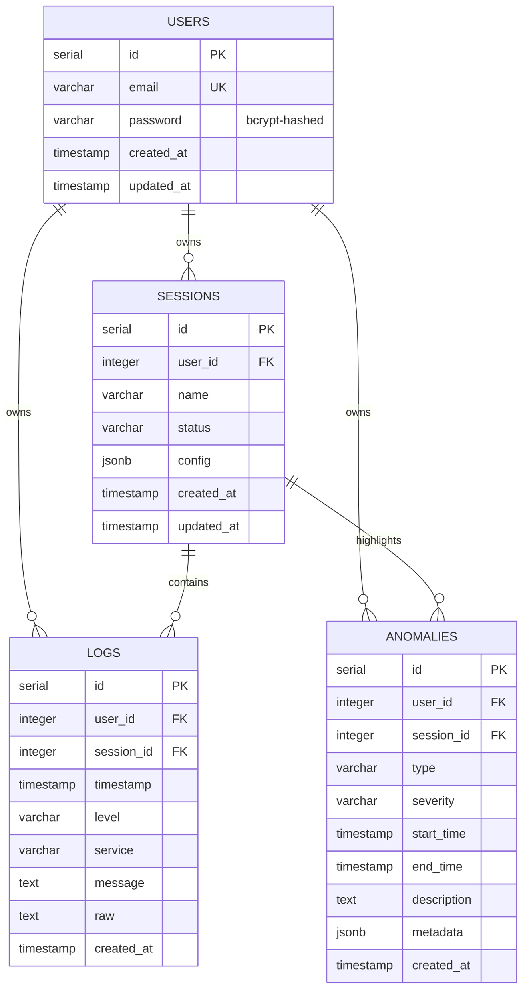

# 🗄️ Database Schema and Isolation

LogGPT uses PostgreSQL to persist user credentials, logging sessions, ingested log events, and anomaly events. The database schema has been designed with strict constraints to prevent cross-tenant data leakage.

---

## 📊 Entity Relationship Diagram



---

## 📋 Tables Description

### 1. `users` Table
Stores basic credentials. Every user is authenticated using standard email/password checks.
* **id**: Unique primary key identifier.
* **email**: Unique email address. Checked during user registration and login.
* **password**: Bcrypt-hashed password string. Plaintext passwords are never saved.
* **created_at / updated_at**: Timestamps.

### 2. `sessions` Table
Stores diagnostic analysis sessions created by users. Each log file uploaded is associated with a session.
* **id**: Unique primary key identifier.
* **user_id**: References `users(id) ON DELETE CASCADE`. Identifies which user owns this session.
* **name**: User-friendly label for the session (e.g. "Payment Service Spill").
* **status**: Tracking state (e.g. `processing`, `completed`).
* **config**: Flexible configurations stored as JSONB.

### 3. `logs` Table
Holds parsed log lines processed from Kafka stream.
* **id**: Unique primary key identifier.
* **user_id**: References `users(id) ON DELETE CASCADE`. Identifies log ownership.
* **session_id**: References `sessions(id) ON DELETE CASCADE`. Ties the log to its parent session.
* **timestamp**: Event time extracted from log message.
* **level**: Severity level of the log (`debug`, `info`, `warn`, `error`, `fatal`).
* **service**: Name of the microservice producing the log.
* **message**: Parsed message body.
* **raw**: The full original log line string.

### 4. `anomalies` Table
Houses anomalies detected in log streams.
* **id**: Unique primary key identifier.
* **user_id**: References `users(id) ON DELETE CASCADE`. Identifies anomaly ownership.
* **session_id**: References `sessions(id) ON DELETE CASCADE`. Ties the anomaly to its parent session.
* **type**: Categorization of the threat (e.g. "Error Spike").
* **severity**: Classified severity level (`low`, `medium`, `high`).
* **start_time / end_time**: Spanning timestamps.
* **description**: Detailed writeup. Contains AI generated troubleshooting logs if Groq is enabled.
* **metadata**: Custom fields (such as detection confidence percentage) stored as JSONB.

---

## ⚡ Index Optimization

To guarantee swift response times under heavy production load, the database schema includes indexes optimized for filtering logs and anomalies by session or user.

```sql
-- Indexes added in backend/init-db.js
CREATE INDEX IF NOT EXISTS idx_users_email ON users (email);
CREATE INDEX IF NOT EXISTS idx_sessions_user_id ON sessions (user_id);
CREATE INDEX IF NOT EXISTS idx_logs_user_id ON logs (user_id);
CREATE INDEX IF NOT EXISTS idx_logs_session_id ON logs (session_id);
CREATE INDEX IF NOT EXISTS idx_logs_timestamp ON logs (timestamp);
CREATE INDEX IF NOT EXISTS idx_anomalies_session_id ON anomalies (session_id);
```

### Purpose of Indexes:
* `idx_users_email`: Dramatically speeds up user lookup queries during user authentication/login.
* `idx_sessions_user_id`, `idx_logs_user_id`: Since all dashboard list routes filter by current `user_id`, indexing these prevents full-table scans.
* `idx_logs_session_id`: Speeds up loading logs for the active workspace session in the UI.
